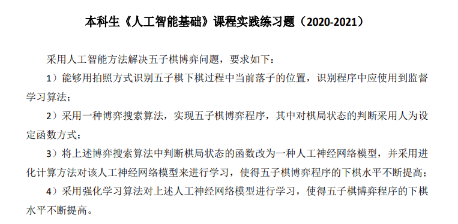
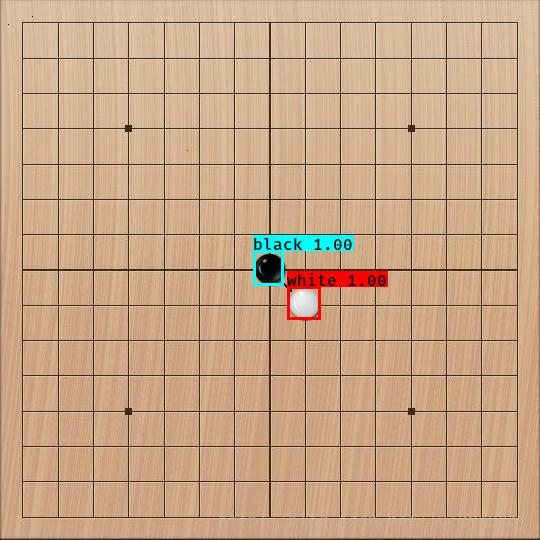
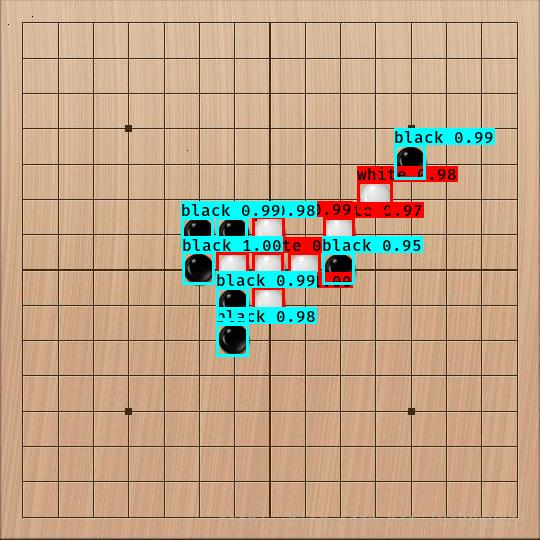
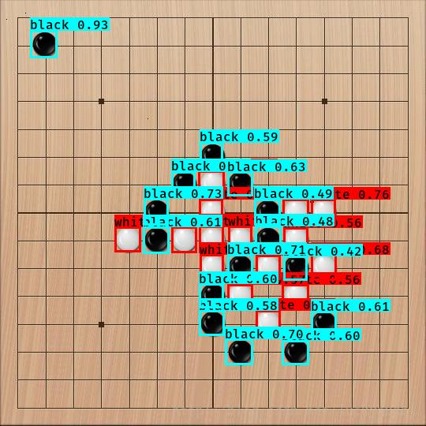

人工智能大作业
==  
###题目
以下是专业选修课《人工智能基础》的大作业
 

### 问题一——棋子识别
#### 方法
监督学习算法——采用YOLO-tiny（基于keras）网上开源代码很多
#### 环境依赖
* **python3.6**
* **NumPy**
* **SciPy**
* **matplotlib**
* **keras==2.1.5**
* **tensorflow==1.6.0**
* **tensorflow-gpu==1.8.0**
#### 效果
个人感觉勉强可以，毕竟数据集不是自己做的，来自大佬[@BIT可达鸭]  

`棋子不密集`
  

`棋子比较密集`
  

`棋子很密集`

显然，棋子密集处检测效果比较不佳

### 问题二——搜索算法
采用alpha-beta剪枝对棋局局面进行搜索
#### 两个要点
* 局面评估函数（具体的算法可以参考这个[博客]）
* alpha-beta剪枝搜索（我是在这个[代码]上面改进的）

### 问题三——学习评估函数
#### 我的想法
1. 先基于keras搭建了神经网络，网络结构如下所示（PS：由于本人缺少神经网络的设计经验，网络的结构是参考网上的分享以及自己乱造的，欢迎各位大佬在issue提出建议~)
2. 在第二问的基础上改进，让两个AI“自相残杀”，目的是生成数据集，数据集存入两个txt文件中
    我的数据集格式是x_train.shape(n,361) y_train.shape(n,1) n代表数据量，361=19*19是棋盘大小
3. 有了数据集我们就可以开始训练啦
4. 把第二问中的评估函数替换成我们所训练的神经网络，让神经网络拟合出评估值

### 第四问——未完待续

###更新
2021-01-06：第三问训练过程中的损失函数没有明显减少，正在分析原因。

